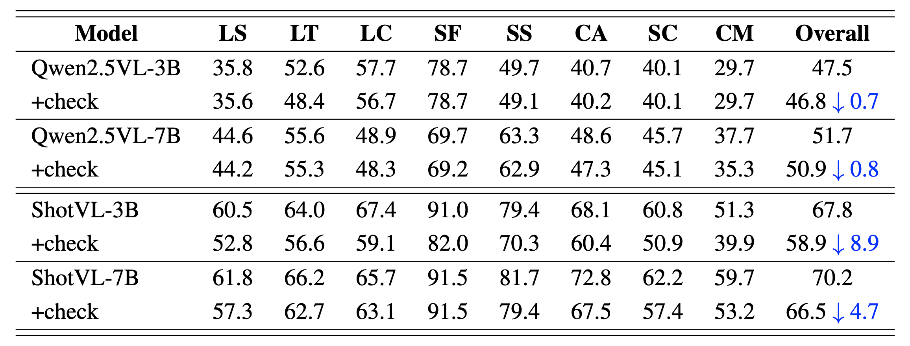
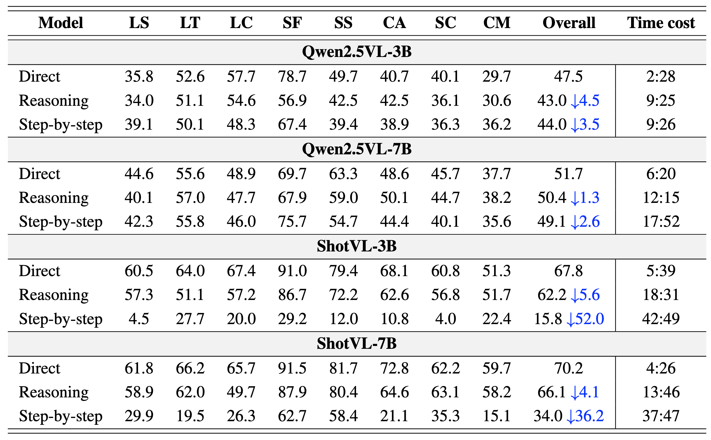

<p align="center" width="100%">

# RefineShot: Rethinking Cinematography Understanding with Foundational Skill Evaluation


<div align="center">
  <div class="is-size-5 publication-authors" style="font-size: 18px;">
    <!-- Paper authors -->
    <span class="author-block">
      <a href="https://wuhang03.github.io/" target="_blank">Hang Wu</a><sup>1</sup>,</span>
    <span class="author-block">
      <a href="https://vanoracai.github.io/" target="_blank">Yujun Cai</a><sup>2</sup>,</span>
    <span class="author-block">
      <a href="https://johnny040216.github.io/" target="_blank">Haonan Ge</a><sup>1</sup>,</span>
    <span class="author-block">
      <a href="SECOND AUTHOR PERSONAL LINK" target="_blank">Hongkai Chen</a><sup>3</sup>,</span>
    <span class="author-block">
      <a href="https://faculty.ucmerced.edu/mhyang/" target="_blank">Ming-Hsuan Yang</a><sup>1</sup>,</span>
    <span class="author-block">
      <a href="https://wangywust.github.io/" target="_blank">Yiwei Wang</a><sup>1†</sup>,</span>
  </div>

  <div class="is-size-5 publication-authors" style="font-size: 18px;">
    <span class="author-block"><sup>1</sup>University of California, Merced, 
      <sup>2</sup>The University of Queensland, 
      <br><sup>3</sup>vivo Mobile Communication Co., Ltd
    </span>
    <span class="eql-cntrb"><small><br><sup>†</sup>Indicates Corresponding Author</small></span>
  </div>
</div>


<div style='display: flex; gap: 0.25rem; justify-content: center; text-align: center;' align="center">
  <a href='https://www.arxiv.org/abs/2510.02423'></a>
  <!-- <a href='https://www.techrxiv.org/users/933923/articles/1304524-dimo-gui-advancing-test-time-scaling-in-gui-grounding-via-modality-aware-visual-reasoning'></a> -->
  <!-- <a href='https://wuhang03.github.io/DiMo-GUI-homepage/'></a> -->
</div>

## 🔥 Update
<!-- * [2024-04-05]: ⭐️⭐️⭐️ VCD is selected as Poster Highlight in CVPR 2024! (Top 11.9% in accepted papers)
* [2023-11-29]: ⭐️ Paper of VCD online. Check out [this link](https://arxiv.org/abs/2311.16922) for details. -->
* [2025-10-02]: 🚀 Codes released.

## 🎯 Overview
<div align="center">
    
</div>

Cinematography understanding refers to the ability to recognize not only the visual content of a scene but also the cinematic techniques that shape narrative meaning. This capability is attracting increasing attention, as it enhances multimodal understanding in real-world applications and underpins coherent content creation in film and media. As the most comprehensive benchmark for this task, ShotBench spans a wide range of cinematic concepts and VQA-style evaluations, with ShotVL achieving state-of-the-art results on it. However, our analysis reveals that ambiguous option design in ShotBench and ShotVL’s shortcomings in reasoning consistency and instruction adherence undermine evaluation reliability, limiting fair comparison and hindering future progress. To overcome these issues, we systematically refine ShotBench through consistent option restructuring, conduct the first critical analysis of ShotVL’s reasoning behavior, and introduce an extended evaluation protocol that jointly assesses task accuracy and core model competencies. These efforts lead to RefineShot, a refined and expanded benchmark that enables more reliable assessment and fosters future advances in cinematography understanding. 


Our contributions are as below:

- **Benchmark Refinement.** We redesign the multiple-choice option sets in ShotBench by enforcing consistent granularity, unified evaluation dimensions, and mutual exclusivity. This renders a coherent and reliable dataset for evaluating cinematography understanding.  

- **Critical Analysis of State-of-the-Art Baselines.** We conduct the first in-depth study of ShotVL, the reported state-of-the-art on ShotBench, and reveal fundamental weaknesses in reasoning, prompt adherence, and output consistency, challenging the validity of its benchmark superiority.  

- **Expanded Evaluation Protocol.** We augment ShotBench with a new protocol that jointly assesses task-specific performance and core model competencies, providing a more balanced and robust framework for fair comparison and future progress in this emerging field. Together, these contributions establish **RefineShot**, a refined and extended benchmark for cinematography understanding.  


## 🕹️ Usage
### Environment Setup
```bash
conda env create -n shot
source activate shot
cd shot
bash setup.sh
```


### Data Preparation
You can use the script below to download and unzip the original **ShotBench** dataset:

```bash
bash data.sh
```

Then you can use the scipt below to obtained the **RefinedBench**. Detailed refinment steps can be found in the paper. Remember to first change the file name `test.tsv` into `test_origin.tsv`, or you can modify `extract.py`.

```bash
python extract.py
```

### Evaluation

Use the shell script to evaluate different vlms, You can change the parameters like `MODEL_NAME` and `CATEGORY` to run different experiments.:
```bash
bash evaluate_qwen.sh
bash evaluate_shotvl.sh
```


Then you can run the `calculate.sh` to calculate the metrics. In the `calculate.sh` script, you can add the arguments `--check_adherence` and `--check_consistency` to calculate the two reliability scores proposed in our paper.

```bash
bash calculate.sh

python evaluation/calculate_scores.py  --check_adherence
python evaluation/calculate_scores.py  --check_consistency
```


## 🔍 Analysis  
- **Model Analysis**. This figure shows two main defects of ShotVL models: reasoning unfaithfulness, with frequent mismatches between reasoning and answers, and poor instruction adherence, where prompts are ignored in favor of long repetitive outputs.
<div align="center">
    
</div>

- **Instruction adherence case.** This case shows the instruction adherence of different models.
When given a demonstration-based prompt, ShotVL fails to follow the instructions and produces
disorganized reasoning, whereas Qwen accurately follows the format, outputting each step and the
final answer as required
<div align="center">
    
</div>


## 🏅 Experiments
- Experimental results of models after **consistency check**. We evaluate all model outputs
for consistency between reasoning and final answers, treating mismatched cases as incorrect. The
Qwen series shows almost no performance drop, while ShotVL suffers a notable decrease, indicating
weaker reasoning faithfulness.

<div align="center">
    
</div>

- Performance of different models on the refined benchmark under **reasoning and step-by-step prompts.** Qwen remains stable across prompts, while ShotVL shows clear performance drops
and higher time cost. Time cost is reported in hours:minutes (hh:mm) format.


<div align="center">
    
</div>

- **Performance and reliability** of different models on the refined benchmark. Using our
proposed evaluation, we find that Qwen achieves near-perfect reliability, significantly outperforming
ShotVL, whose results are notably weaker, particularly in instruction adherence.


<div align="center">
    
</div>


## 📑 Citation
If you find our project useful, we hope you can star our repo and cite our paper as follows:
```
@article{wu2025refineshot,
  title={RefineShot: Rethinking Cinematography Understanding with Foundational Skill Evaluation},
  author={Wu, Hang and Cai, Yujun and Ge, Haonan and Chen, Hongkai and Yang, Ming-Hsuan and Wang, Yiwei},
  journal={arXiv preprint arXiv:2510.02423},
  year={2025}
}

```


## 📝 Related Projects
Our repository is based on the following projects, we sincerely thank them for their great efforts and excellent work.
- [ShotBench](https://github.com/Vchitect/ShotBench): latest cinemagraphy understanding benchmark.

## License

This project is licensed under the terms of the Apache License 2.0.
You are free to use, modify, and distribute this software under the conditions of the license. See the LICENSE file for details.